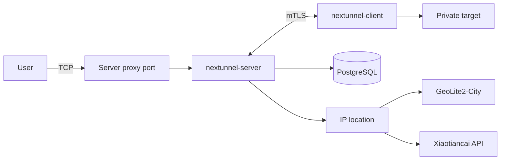

<div align="center">

<h1 style="border-bottom: none"><b>nextunnel-server</b></h1>

[](https://go.dev/)
[](./LICENSE)

<a href="./README.md"></a>
<a href="./README_zh.md"></a>

</div>

## Overview

`nextunnel-server` is the **server** component of the [nextunnel](https://github.com/xiaotiancaipro/nextunnel)
reverse-tunnel system. Clients connect over mutual TLS; the server listens on public proxy ports and forwards traffic to
targets reachable from the client.

Capabilities:

- Accept mutual TLS (mTLS) connections from nextunnel clients
- Register clients and allocate remote port ranges via CLI
- Listen on remote proxy ports based on client-submitted proxy configuration and sync them to PostgreSQL
- Enforce IP / geo / network-category access control rules stored in PostgreSQL
- Record every inbound user connection (IP, geo, category, allow/deny decision) in PostgreSQL



## Requirements

| Dependency           | Notes                                                                                                                                                  |
|----------------------|--------------------------------------------------------------------------------------------------------------------------------------------------------|
| Go 1.26+             | Required for local builds only                                                                                                                         |
| PostgreSQL           | Stores clients, proxies, access rules, and connection logs                                                                                             |
| IP location (one of) | **GeoIP mode**: download [MaxMind GeoLite2-City](https://dev.maxmind.com/geoip/geolite2-free-geolocation-data) and place at `geoip/GeoLite2-City.mmdb` |
|                      | **API mode**: create an ApiKey via the [Xiaotiancai docs](https://www.xiaotiancai.tech/docs); lookups are billed per successful query                  |

## Quick Start

```bash
# 1. Prepare IP location (choose one based on [ip_location].type)
# GeoIP mode: place GeoLite2-City.mmdb at geoip/GeoLite2-City.mmdb
# API mode: set type = "api" and api_key in nextunnel-server.toml

# 2. Copy and edit configuration (database, IP location, timezone, etc.)
cp nextunnel-server.example.toml nextunnel-server.toml

# 3. Build and run (reads nextunnel-server.toml by default, or $NEXTUNNEL_SERVER_CONFIG)
go build -o nextunnel-server .
./nextunnel-server
```

On startup the server: loads config → connects to PostgreSQL (auto-migration) → initializes IP location (GeoIP or API) →
listens on
`0.0.0.0:<port>` → ensures CA and server TLS certificates exist under `[cert].dir`.

### Client Onboarding

End-to-end flow: **register client → generate certificates → client connects → proxies sync automatically**.

```bash
# 1. Create a client (optional remote port range)
./nextunnel-server client create --port-start 5000 --port-end 5005 macbook

# Omit --port-start / --port-end to allow any remote port
./nextunnel-server client create macbook

# 2. Generate TLS certificates for that client
./nextunnel-server client generate-certs --dir ./certs/macbook macbook
```

**Create client:**

- Inserts a row into the PostgreSQL `client` table with the client name and port range
- `--port-start` and `--port-end` must be specified together; when omitted, the client may use any remote port
- Client names are globally unique

**Generate certificates:**

- Verifies the client is registered in the database
- Reads the CA from `[cert].dir` (`ca.crt` / `ca.key`); missing CA or server certs are generated automatically
- Writes `client.crt` and `client.key` to the directory given by `--dir`; exits with an error if either file already
  exists
- Client certificates are valid for 1 year; CA certificates for 10 years

**Configure nextunnel-client:**

Point [nextunnel-client](https://github.com/xiaotiancaipro/nextunnel-client) at the generated certs and client name:

```toml
[client]
id = "macbook"

[cert]
ca_file = "certs/ca.crt"
cert_file = "certs/macbook/client.crt"
key_file = "certs/macbook/client.key"

[[proxies]]
name = "ssh"
type = "tcp"
local_ip = "127.0.0.1"
local_port = 22
remote_port = 5000
```

When the client connects, the server syncs `[[proxies]]` into the PostgreSQL `proxy` table. Proxies are marked
`status = 1` (online) while connected and `status = 0` (offline) after disconnect. If a port range was assigned, each
`remote_port` must fall within that range.

### Cross-Platform Builds

```bash
./script/build.sh
```

Binaries are written to `bin/` as `nextunnel-server-<version>-<os>-<arch>[.exe]`.

## Docker

The `docker/` directory provides Compose stacks for a full deployment (PostgreSQL + server) and middleware-only (
PostgreSQL alone).

```bash
cd docker
cp example.env .env
# Edit .env (database credentials, ports, etc.)
# Edit volumes/nextunnel/config/nextunnel-server.toml (timezone, IP location, logs, etc.)
# GeoIP mode: place GeoLite2-City.mmdb under volumes/nextunnel/geoip/

# Start PostgreSQL + nextunnel-server
docker compose up -d

# Or PostgreSQL only (run nextunnel-server on the host yourself)
docker compose -f docker-compose.middleware.yaml up -d
```

Mounted paths inside the container:

| Host path                   | Container path                 |
|-----------------------------|--------------------------------|
| `volumes/nextunnel/config/` | `/usr/local/nextunnel/config/` |
| `volumes/nextunnel/certs/`  | `/usr/local/nextunnel/certs/`  |
| `volumes/nextunnel/geoip/`  | `/usr/local/nextunnel/geoip/`  |
| `volumes/nextunnel/logs/`   | `/usr/local/nextunnel/logs/`   |

Default command: `nextunnel-server --config config/nextunnel-server.toml`.

## CLI Reference

```bash
nextunnel-server [--config <path>]          # Start server (foreground)
nextunnel-server client <command>           # Client tools
nextunnel-server ip-filter <command>        # Access control rule management
```

Global flags:

| Flag              | Default                 | Description                                                                   |
|-------------------|-------------------------|-------------------------------------------------------------------------------|
| `--config`        | `nextunnel-server.toml` | Configuration file path; when unset, falls back to `$NEXTUNNEL_SERVER_CONFIG` |
| `-h`, `--help`    | —                       | Show help                                                                     |
| `-v`, `--version` | —                       | Show version                                                                  |

With no subcommand, the server runs in the foreground. Press `Ctrl+C` or send `SIGTERM` for graceful shutdown.

### Client Management

Client records and certificates are managed via the `client` subcommand and stored in PostgreSQL. Changes take effect
while the server is running.

```bash
# Create a client (optional port range)
nextunnel-server client create [--port-start <n>] [--port-end <n>] <name>

# Generate certificates for a registered client
nextunnel-server client generate-certs --dir <output-dir> <name>
```

| Command          | Description                                                                    |
|------------------|--------------------------------------------------------------------------------|
| `create`         | Inserts into the `client` table; omit port flags to allow any remote port      |
| `generate-certs` | Verifies the client exists, then writes `client.crt` / `client.key` to `--dir` |

### Access Control Rules

Rules are managed via the `ip-filter` subcommand and stored in PostgreSQL. They take effect **immediately** without
restarting the server.

```bash
# List current rules
nextunnel-server ip-filter list

# Add allow / block rules
nextunnel-server ip-filter add --allow --ip 203.0.113.10
nextunnel-server ip-filter add --block --city Shenzhen
nextunnel-server ip-filter add --allow --region Guangdong
nextunnel-server ip-filter add --block --country China

# Network categories: all / local / remote
nextunnel-server ip-filter add --block --all
nextunnel-server ip-filter add --allow --local
nextunnel-server ip-filter add --block --remote

# Delete rules (match the allow/block dimension used when adding)
nextunnel-server ip-filter delete --allow --ip 203.0.113.10
nextunnel-server ip-filter delete --block --country China
```

**Rule semantics:**

| Topic    | Details                                                                                                                                                     |
|----------|-------------------------------------------------------------------------------------------------------------------------------------------------------------|
| IP       | IPv4 and IPv6 supported; addresses are normalized before storage                                                                                            |
| Geo      | Names must match the active IP location provider (see connection logs; GeoIP mode depends on `geoip_locales`; API mode usually returns Chinese place names) |
| Status   | Allow list → `status = 1`; block list → `status = 0`                                                                                                        |
| Default  | Connections are **allowed** when no rule matches                                                                                                            |
| Priority | ① Allow beats Block at equal specificity; ② IP > City > Region > Country > category (LOCAL/REMOTE > ALL)                                                    |

## Configuration

See [`nextunnel-server.example.toml`](nextunnel-server.example.toml) for a full example.

**GeoIP mode (local mmdb):**

```toml
[ip_location]
type = "geoip"
geoip_db_path = "geoip/GeoLite2-City.mmdb"
geoip_locales = ["zh-CN", "en"]
```

**API mode (online lookup):**

```toml
[ip_location]
type = "api"
api_key = "your-api-key"
```

| Section         | Field                                            | Description                                                                                     |
|-----------------|--------------------------------------------------|-------------------------------------------------------------------------------------------------|
| `[server]`      | `port`                                           | Listen port (binds to all interfaces, `0.0.0.0`)                                                |
| `[cert]`        | `host`                                           | Hostname or IP for auto-generated certificate SAN (not the listen address)                      |
|                 | `dir`                                            | Certificate directory (CA, server, and client cert generation)                                  |
| `[database]`    | `host` / `port` / `username` / `password` / `db` | PostgreSQL connection                                                                           |
|                 | `sslmode`                                        | libpq SSL mode; defaults to `disable`                                                           |
| `[ip_location]` | `type`                                           | Lookup provider: `geoip` (local mmdb, default) or `api` (online API)                            |
|                 | `api_key`                                        | Required for API mode; see the [API docs](https://www.xiaotiancai.tech/docs) for ApiKey setup   |
|                 | `geoip_db_path`                                  | Path to GeoLite2-City database for GeoIP mode                                                   |
|                 | `geoip_locales`                                  | Ordered locale codes for GeoIP names, e.g. `["zh-CN", "en"]`; geo rules must use resolved names |
| `[logs]`        | `file`                                           | Log path (daily rotation with size-based segments)                                              |
|                 | `level`                                          | `debug`, `info`, `warn`, or `error`                                                             |
|                 | `maxSize`                                        | Max segment size, e.g. `100MB`, `1GB`; bare number = MB                                         |
|                 | `maxBackups`                                     | Max number of daily log files to retain                                                         |
|                 | `maxAge`                                         | Max log retention in days                                                                       |
| `[timezone]`    | `location`                                       | IANA timezone for log display and daily log rotation; defaults to `Asia/Shanghai`               |

## License

This project is licensed under the [Apache License 2.0](./LICENSE).
