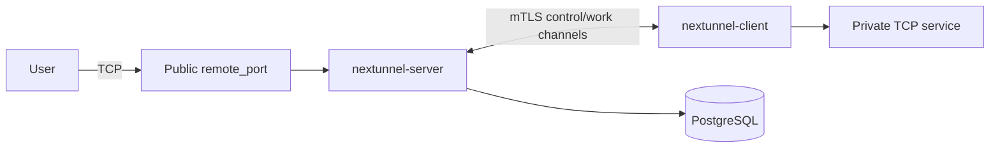

<div align="center">

<h1 style="border-bottom: none"><b>Nextunnel</b></h1>

**Secure reverse TCP tunnels for private networks**

Outbound-first · mTLS by default · PostgreSQL-backed control plane · single Go binaries

[](https://go.dev/)
[](./LICENSE)

<a href="./README.md"></a>
<a href="./README_zh.md"></a>

</div>

## What is Nextunnel

Nextunnel is a reverse tunnel stack for exposing private TCP services through a public server. `nextunnel-client` runs inside the private network and dials out to `nextunnel-server`; the server listens on public proxy ports and forwards accepted traffic back through mTLS control and work channels.

Unlike token-only tunnel setups, Nextunnel treats client certificates as the primary admission boundary. The server owns the CA, verifies client certificates with `RequireAndVerifyClientCert`, and stores operational state in PostgreSQL.



## Features

- **TCP reverse proxying**: expose private TCP services such as SSH, databases, or development services through server-side ports.
- **mTLS-first access**: the server bootstraps CA/server certificates and verifies every client certificate.
- **Client onboarding**: register clients, assign optional remote port ranges, create/list/download/delete client certificates.
- **Access control**: allow or block by IP, country, region, city, local traffic, remote traffic, or all traffic.
- **Connection records**: store proxy state and access logs in PostgreSQL.
- **Resilient clients**: reconnect automatically with 2s to 30s exponential backoff and heartbeat-based control channels.
- **Optional management API**: enable the server HTTP API with `[web].enabled = true`.

## Quick Start

```bash
# Build both binaries.
mkdir -p bin
make build

# Or build explicitly.
mkdir -p bin
go build -o bin/nextunnel-server ./cmd/server
go build -o bin/nextunnel-client ./cmd/client
```

1. Start PostgreSQL and `nextunnel-server`.
2. Create a client with `nextunnel-server client create <name>`.
3. Create and download a client certificate with `nextunnel-server client cert create/list/download`.
4. Copy `ca.crt`, `client.crt`, and `client.key` to the client host.
5. Configure `nextunnel-client.toml` and start `nextunnel-client`.

See the component guides for exact commands and configuration:

- [Server guide](./docs/en/server.md)
- [Client guide](./docs/en/client.md)
- [Documentation index](./docs/README.md)

## Repository Layout

```text
cmd/server/       nextunnel-server CLI entrypoint
cmd/client/       nextunnel-client CLI entrypoint
internal/server/  server app, services, controllers, and persistence
internal/client/  client app and forwarding services
internal/shared/  shared protocol, cert, logging, and config helpers
docker/server/    server and PostgreSQL Compose files
docker/client/    client Compose file
docs/             detailed English and Chinese documentation
```

## Configuration Examples

- [`nextunnel-server.example.toml`](./nextunnel-server.example.toml)
- [`nextunnel-client.example.toml`](./nextunnel-client.example.toml)

## Roadmap

- More proxy types, including UDP and HTTP/HTTPS routing.
- Richer certificate policies and revocation workflows.
- User and tenant-oriented management.
- A web console built on top of the management API.

## License

Nextunnel is licensed under the [Apache License 2.0](./LICENSE).
