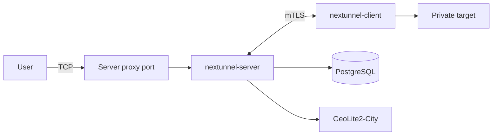

<div align="center">

<h1 style="border-bottom: none"><b>nextunnel-server</b></h1>

[](https://go.dev/)
[](./LICENSE)

<a href="./README.md"></a>
<a href="./README_zh.md"></a>

</div>

## Overview

`nextunnel-server` is the **server** component of the [nextunnel](https://github.com/xiaotiancaipro/nextunnel)
reverse-tunnel system. Clients connect over mutual TLS; the server listens on public proxy ports and forwards traffic to
targets reachable from the client.

Capabilities:

- Accept **mutual TLS (mTLS)** connections from nextunnel clients
- Listen on remote proxy ports based on client-submitted proxy configuration
- Enforce **IP / geo / network-category** access control rules stored in PostgreSQL
- Record every inbound user connection (IP, geo, category, allow/deny decision) in PostgreSQL



## Requirements

| Dependency    | Notes                                                                                                                         |
|---------------|-------------------------------------------------------------------------------------------------------------------------------|
| Go 1.26+      | Required for local builds only                                                                                                |
| PostgreSQL    | Stores access rules and connection logs                                                                                       |
| GeoLite2-City | Download from [MaxMind](https://dev.maxmind.com/geoip/geolite2-free-geolocation-data) and place at `geoip/GeoLite2-City.mmdb` |

## Quick Start

```bash
# 1. Prepare the GeoIP database
# Place GeoLite2-City.mmdb at geoip/GeoLite2-City.mmdb

# 2. Copy and edit configuration
cp nextunnel-server.example.toml nextunnel-server.toml

# 3. Build and run (reads nextunnel-server.toml by default)
go build -o nextunnel-server .
./nextunnel-server
```

On startup the server: loads config → connects to PostgreSQL (auto-migration) → loads GeoIP → listens on
`0.0.0.0:<port>` → ensures CA and server TLS certificates exist under `[tls].dir`.

> `[server].host` is used for TLS certificate SAN generation only, **not** as the listen address.

### Generate Client Certificates

```bash
./nextunnel-server client generate-certs ./client-certs
```

- Reads the CA from `[tls].dir` (`ca.crt` / `ca.key`); missing CA or server certs are generated automatically
- Writes `client.crt` and `client.key` to the output directory; exits with an error if either file already exists
- Client certificates are valid for 1 year; CA certificates for 10 years

Configure the generated certificates in [nextunnel-client](https://github.com/xiaotiancaipro/nextunnel-client) to
connect to this server.

### Cross-Platform Builds

```bash
./script/build.sh
```

Binaries are written to `dist/` as `nextunnel-server-<version>-<os>-<arch>[.exe]`.

## Docker

The `docker/` directory provides Compose stacks for a full deployment (PostgreSQL + server) and middleware-only (
PostgreSQL alone).

```bash
cd docker
cp example.env .env
# Edit .env as needed (database credentials, ports, etc.)

# Start PostgreSQL + nextunnel-server
docker compose up -d

# Or PostgreSQL only (run nextunnel-server on the host yourself)
docker compose -f docker-compose.middleware.yaml up -d
```

## CLI Reference

```bash
nextunnel-server [--config <path>]          # Start server (foreground)
nextunnel-server client <command>           # Client tools
nextunnel-server ip-filter <command>        # Access control rule management
```

Global flags:

| Flag              | Default                 | Description             |
|-------------------|-------------------------|-------------------------|
| `--config`        | `nextunnel-server.toml` | Configuration file path |
| `-h`, `--help`    | —                       | Show help               |
| `-v`, `--version` | —                       | Show version            |

With no subcommand, the server runs in the foreground. Press `Ctrl+C` or send `SIGTERM` for graceful shutdown.

### Access Control Rules

Rules are managed via the `ip-filter` subcommand and stored in PostgreSQL. They take effect **immediately** without
restarting the server.

```bash
# List current rules
nextunnel-server ip-filter list

# Add allow / block rules
nextunnel-server ip-filter add --allow --ip 203.0.113.10
nextunnel-server ip-filter add --block --city Shenzhen
nextunnel-server ip-filter add --allow --region Guangdong
nextunnel-server ip-filter add --block --country China

# Network categories: all / local / remote
nextunnel-server ip-filter add --block --all
nextunnel-server ip-filter add --allow --local
nextunnel-server ip-filter add --block --remote

# Delete rules (match the allow/block dimension used when adding)
nextunnel-server ip-filter delete --allow --ip 203.0.113.10
nextunnel-server ip-filter delete --block --country China
```

**Rule semantics:**

| Topic    | Details                                                                                                               |
|----------|-----------------------------------------------------------------------------------------------------------------------|
| IP       | IPv4 and IPv6 supported; addresses are normalized before storage                                                      |
| Geo      | Names must match GeoIP results under `[geoip].locales` (see connection logs, e.g. `China` / `Guangdong` / `Shenzhen`) |
| Status   | Allow list → `status = 1`; block list → `status = 0`                                                                  |
| Default  | Connections are **allowed** when no rule matches                                                                      |
| Priority | ① Allow beats Block at equal specificity; ② IP > City > Region > Country > category (LOCAL/REMOTE > ALL)              |

## Configuration

See [`nextunnel-server.example.toml`](nextunnel-server.example.toml) for a full example.

| Section      | Field                                            | Description                                                                                     |
|--------------|--------------------------------------------------|-------------------------------------------------------------------------------------------------|
| `[server]`   | `host`                                           | Hostname or IP for TLS certificate SAN (not the listen address)                                 |
|              | `port`                                           | Listen port (binds to all interfaces, `0.0.0.0`)                                                |
| `[logs]`     | `file`                                           | Log path (daily rotation with size-based segments)                                              |
|              | `level`                                          | `debug`, `info`, `warn`, or `error`                                                             |
|              | `maxSize`                                        | Max segment size, e.g. `100MB`, `1GB`; bare number = MB                                         |
|              | `maxBackups`                                     | Max number of daily log files to retain                                                         |
|              | `maxAge`                                         | Max log retention in days                                                                       |
| `[tls]`      | `dir`                                            | Certificate directory (CA, server, and client cert generation)                                  |
| `[database]` | `host` / `port` / `username` / `password` / `db` | PostgreSQL connection                                                                           |
|              | `sslmode`                                        | libpq SSL mode; defaults to `disable`                                                           |
| `[geoip]`    | `db_path`                                        | Path to GeoLite2-City database (required)                                                       |
|              | `locales`                                        | Ordered locale codes for GeoIP names, e.g. `["zh-CN", "en"]`; geo rules must use resolved names |

## License

This project is licensed under the [Apache License 2.0](./LICENSE).
