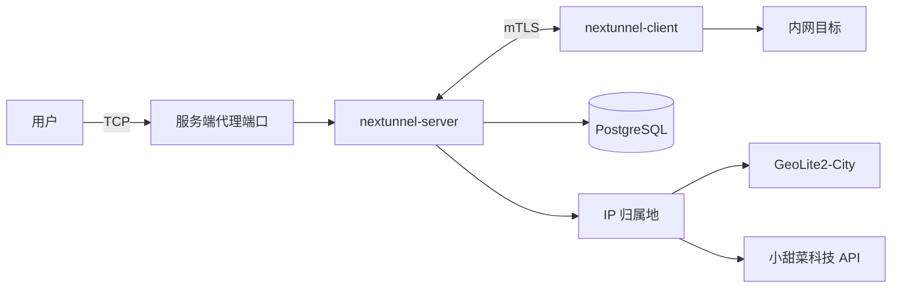

<div align="center">

<h1 style="border-bottom: none"><b>nextunnel-server</b></h1>

[](https://go.dev/)
[](./LICENSE)

<a href="./README.md"></a>
<a href="./README_zh.md"></a>

</div>

## 概述

`nextunnel-server` 是 [nextunnel](https://github.com/xiaotiancaipro/nextunnel) 反向隧道系统的**服务端**组件，与客户端配合使用：客户端通过
mTLS 连入服务端，由服务端在公网侧监听代理端口并转发流量。

主要能力：

- 接受 nextunnel 客户端的 mTLS 连接
- 通过 CLI 注册客户端并分配远程端口范围
- 根据客户端提交的代理配置在宿主机上监听远程端口，并同步写入 PostgreSQL
- 基于 PostgreSQL 中的规则执行 IP / 地域 / 网络类别访问控制
- 将每次入站用户连接（IP、地域、网络类别、放行/拒绝结果）写入 PostgreSQL



## 环境要求

| 依赖          | 说明                                                                                                                                   |
|-------------|--------------------------------------------------------------------------------------------------------------------------------------|
| Go 1.26+    | 仅本地编译时需要                                                                                                                             |
| PostgreSQL  | 客户端、代理、访问规则与连接日志存储                                                                                                                   |
| IP 归属地（二选一） | **GeoIP 模式**：下载 [MaxMind GeoLite2-City](https://dev.maxmind.com/geoip/geolite2-free-geolocation-data)，保存为 `geoip/GeoLite2-City.mmdb` |
|             | **API 模式**：在 [小甜菜科技控制台](https://www.xiaotiancai.tech/docs) 创建 ApiKey，按次计费查询归属地                                                       |

## 快速开始

```bash
# 1. 准备 IP 归属地（按 [ip_location].type 选择其一）
# GeoIP 模式：将 GeoLite2-City.mmdb 放到 geoip/GeoLite2-City.mmdb
# API 模式：在 nextunnel-server.toml 中设置 type = "api" 并填写 api_key

# 2. 复制并编辑配置（数据库、IP 归属地、时区等）
cp nextunnel-server.example.toml nextunnel-server.toml

# 3. 编译并启动（默认读取 nextunnel-server.toml，或通过 $NEXTUNNEL_SERVER_CONFIG 指定）
go build -o nextunnel-server .
./nextunnel-server
```

启动后程序会：加载配置 → 连接 PostgreSQL（自动建表）→ 初始化 IP 归属地（GeoIP 或 API）→ 在 `0.0.0.0:<port>` 监听 → 在
`[cert].dir` 下自动确保 CA
与服务端证书存在。

### 接入客户端

完整流程：**注册客户端 → 生成证书 → 客户端连接 → 代理自动同步**。

```bash
# 1. 创建客户端（可选限制 remote 端口范围）
./nextunnel-server client create --port-start 5000 --port-end 5005 macbook

# 不限制端口时可省略 --port-start / --port-end
./nextunnel-server client create macbook

# 2. 为该客户端生成 TLS 证书
./nextunnel-server client generate-certs --dir ./certs/macbook macbook
```

**创建客户端：**

- 写入 PostgreSQL `client` 表，记录客户端名称与端口范围
- `--port-start` 与 `--port-end` 须同时指定；省略时表示该客户端可使用任意 remote 端口
- 客户端名称全局唯一

**生成证书：**

- 校验客户端已在数据库中注册
- 从配置中 `[cert].dir` 读取 CA（`ca.crt` / `ca.key`）；若 CA 或服务端证书不存在会自动生成
- 在 `--dir` 指定目录输出 `client.crt` 与 `client.key`；目标目录中若已存在同名文件则报错退出
- 客户端证书有效期 1 年，CA 证书有效期 10 年

**配置 nextunnel-client：**

将生成的证书与客户端名称配置到 [nextunnel-client](https://github.com/xiaotiancaipro/nextunnel-client)：

```toml
[client]
id = "macbook"

[cert]
ca_file = "certs/ca.crt"
cert_file = "certs/macbook/client.crt"
key_file = "certs/macbook/client.key"

[[proxies]]
name = "ssh"
type = "tcp"
local_ip = "127.0.0.1"
local_port = 22
remote_port = 5000
```

客户端连接后，服务端会将 `[[proxies]]` 同步至 PostgreSQL `proxy` 表；连接期间 `status = 1`（在线），断开连接后自动更新为
`status = 0`（离线）。若客户端配置了端口范围，其 `remote_port` 须在分配范围内。

### 多平台构建

```bash
./script/build.sh
```

二进制文件输出至 `bin/`，命名格式为 `nextunnel-server-<version>-<os>-<arch>[.exe]`。

## Docker 部署

`docker/` 目录提供完整栈（PostgreSQL + 服务端）与仅中间件两种 Compose 编排。

```bash
cd docker
cp example.env .env
# 按需修改 .env（数据库账号、端口等）
# 编辑 volumes/nextunnel/config/nextunnel-server.toml（时区、IP 归属地、日志等）
# GeoIP 模式：将 GeoLite2-City.mmdb 放到 volumes/nextunnel/geoip/

# 启动 PostgreSQL + nextunnel-server
docker compose up -d

# 或仅启动 PostgreSQL（自行在宿主机运行 nextunnel-server）
docker compose -f docker-compose.middleware.yaml up -d
```

容器内挂载路径：

| 宿主机路径                       | 容器路径                           |
|-----------------------------|--------------------------------|
| `volumes/nextunnel/config/` | `/usr/local/nextunnel/config/` |
| `volumes/nextunnel/certs/`  | `/usr/local/nextunnel/certs/`  |
| `volumes/nextunnel/geoip/`  | `/usr/local/nextunnel/geoip/`  |
| `volumes/nextunnel/logs/`   | `/usr/local/nextunnel/logs/`   |

默认启动命令：`nextunnel-server --config config/nextunnel-server.toml`。

## CLI 参考

```bash
nextunnel-server [--config <path>]          # 启动服务端（前台）
nextunnel-server client <command>           # 客户端工具
nextunnel-server ip-filter <command>        # 访问控制规则管理
```

全局标志：

| 标志                | 默认值                     | 说明                                            |
|-------------------|-------------------------|-----------------------------------------------|
| `--config`        | `nextunnel-server.toml` | 配置文件路径；未指定时回退到环境变量 `$NEXTUNNEL_SERVER_CONFIG` |
| `-h`, `--help`    | —                       | 显示帮助                                          |
| `-v`, `--version` | —                       | 显示版本                                          |

未指定子命令时以前台方式运行服务端；按 `Ctrl+C` 或发送 `SIGTERM` 可优雅退出。

### 客户端管理

客户端记录与证书通过 `client` 子命令管理，写入 PostgreSQL 并在服务端运行时生效。

```bash
# 创建客户端（可选端口范围）
nextunnel-server client create [--port-start <n>] [--port-end <n>] <name>

# 为已注册客户端生成证书
nextunnel-server client generate-certs --dir <output-dir> <name>
```

| 命令               | 说明                                                  |
|------------------|-----------------------------------------------------|
| `create`         | 在 `client` 表插入记录；省略端口参数表示不限制 remote 端口              |
| `generate-certs` | 校验客户端存在后，在 `--dir` 目录生成 `client.crt` / `client.key` |

### 访问控制规则

规则通过 `ip-filter` 子命令写入 PostgreSQL，**服务端运行时即时生效**，无需重启。

```bash
# 列出当前规则
nextunnel-server ip-filter list

# 添加白名单 / 黑名单
nextunnel-server ip-filter add --allow --ip 203.0.113.10
nextunnel-server ip-filter add --block --city Shenzhen
nextunnel-server ip-filter add --allow --region Guangdong
nextunnel-server ip-filter add --block --country China

# 网络类别：all / local / remote
nextunnel-server ip-filter add --block --all
nextunnel-server ip-filter add --allow --local
nextunnel-server ip-filter add --block --remote

# 删除规则（需与添加时的 allow/block 维度一致）
nextunnel-server ip-filter delete --allow --ip 203.0.113.10
nextunnel-server ip-filter delete --block --country China
```

**规则说明：**

| 项目   | 说明                                                                                  |
|------|-------------------------------------------------------------------------------------|
| IP   | 支持 IPv4 / IPv6，写入前自动规范化                                                             |
| 地域   | 名称须与当前 IP 归属地 provider 的解析结果一致（可参考连接日志；GeoIP 模式受 `geoip_locales` 影响，API 模式通常返回中文地名） |
| 状态   | 白名单 `status = 1`，黑名单 `status = 0`                                                   |
| 默认策略 | 无匹配规则时**允许**连接                                                                      |
| 优先级  | ① 同等精确度下 Allow > Block；② IP > City > Region > Country > 类别（LOCAL/REMOTE > ALL）      |

## 配置说明

完整示例见 [`nextunnel-server.example.toml`](nextunnel-server.example.toml)。

**GeoIP 模式（本地 mmdb）：**

```toml
[ip_location]
type = "geoip"
geoip_db_path = "geoip/GeoLite2-City.mmdb"
geoip_locales = ["zh-CN", "en"]
```

**API 模式（在线查询）：**

```toml
[ip_location]
type = "api"
api_key = "your-api-key"
```

| 配置段             | 字段                                               | 说明                                                                  |
|-----------------|--------------------------------------------------|---------------------------------------------------------------------|
| `[server]`      | `port`                                           | 监听端口（绑定所有网卡 `0.0.0.0`）                                              |
| `[cert]`        | `host`                                           | 自动生成证书时的 SAN 主机名或 IP（非监听地址）                                         |
|                 | `dir`                                            | 证书目录（CA、服务端及客户端证书生成）                                                |
| `[database]`    | `host` / `port` / `username` / `password` / `db` | PostgreSQL 连接                                                       |
|                 | `sslmode`                                        | libpq SSL 模式，默认 `disable`                                           |
| `[ip_location]` | `type`                                           | 归属地查询方式：`geoip`（本地 mmdb，默认）或 `api`（在线 API）                          |
|                 | `api_key`                                        | API 模式必填；ApiKey 可在 [文档中心](https://www.xiaotiancai.tech/docs) 查看获取方式 |
|                 | `geoip_db_path`                                  | GeoIP 模式的 GeoLite2-City 数据库路径                                       |
|                 | `geoip_locales`                                  | GeoIP 模式的地名语言优先级，如 `["zh-CN", "en"]`；地域规则须与解析结果一致                   |
| `[logs]`        | `file`                                           | 日志路径（按天轮转，超出大小自动分段）                                                 |
|                 | `level`                                          | `debug` / `info` / `warn` / `error`                                 |
|                 | `maxSize`                                        | 单段最大大小，如 `100MB`、`1GB`；纯数字默认为 MB                                    |
|                 | `maxBackups`                                     | 保留的按天日志文件数量上限                                                       |
|                 | `maxAge`                                         | 日志最大保留天数                                                            |
| `[timezone]`    | `location`                                       | 日志展示与按天轮转的 IANA 时区，默认 `Asia/Shanghai`                               |

## 许可证

本项目采用 [Apache License 2.0](./LICENSE)。
