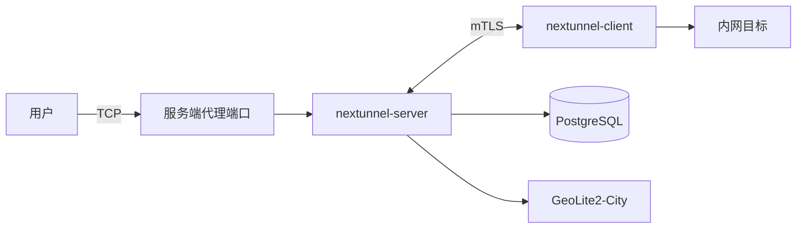

<div align="center">

<h1 style="border-bottom: none"><b>nextunnel-server</b></h1>

[](https://go.dev/)
[](./LICENSE)

<a href="./README.md"></a>
<a href="./README_zh.md"></a>

</div>

## 概述

`nextunnel-server` 是 [nextunnel](https://github.com/xiaotiancaipro/nextunnel) 反向隧道系统的**服务端**组件，与客户端配合使用：客户端通过
mTLS 连入服务端，由服务端在公网侧监听代理端口并转发流量。

主要能力：

- 接受 nextunnel 客户端的**双向 TLS（mTLS）**连接
- 根据客户端提交的代理配置在宿主机上监听远程端口
- 基于 PostgreSQL 中的规则执行 **IP / 地域 / 网络类别**访问控制
- 将每次入站用户连接（IP、地域、网络类别、放行/拒绝结果）写入 PostgreSQL



## 环境要求

| 依赖            | 说明                                                                                                                      |
|---------------|-------------------------------------------------------------------------------------------------------------------------|
| Go 1.26+      | 仅本地编译时需要                                                                                                                |
| PostgreSQL    | 访问规则与连接日志存储                                                                                                             |
| GeoLite2-City | 下载 [MaxMind GeoLite2-City](https://dev.maxmind.com/geoip/geolite2-free-geolocation-data)，保存为 `geoip/GeoLite2-City.mmdb` |

## 快速开始

```bash
# 1. 准备 GeoIP 数据库
# 将 GeoLite2-City.mmdb 放到 geoip/GeoLite2-City.mmdb

# 2. 复制并编辑配置
cp nextunnel-server.example.toml nextunnel-server.toml

# 3. 编译并启动（默认读取 nextunnel-server.toml）
go build -o nextunnel-server .
./nextunnel-server
```

启动后程序会：加载配置 → 连接 PostgreSQL（自动建表）→ 加载 GeoIP → 在 `0.0.0.0:<port>` 监听 → 在 `[tls].dir` 下自动确保 CA
与服务端证书存在。

> `[server].host` 仅用于 TLS 证书 SAN 生成，**不是**实际监听地址。

### 生成客户端证书

```bash
./nextunnel-server client generate-certs ./client-certs
```

- 从配置中 `[tls].dir` 读取 CA（`ca.crt` / `ca.key`）；若 CA 或服务端证书不存在会自动生成
- 在指定目录输出 `client.crt` 与 `client.key`；目标目录中若已存在同名文件则报错退出
- 客户端证书有效期 1 年，CA 证书有效期 10 年

将生成的证书配置到 [nextunnel-client](https://github.com/xiaotiancaipro/nextunnel-client) 后即可连接本服务端。

### 多平台构建

```bash
./script/build.sh
```

二进制文件输出至 `dist/`，命名格式为 `nextunnel-server-<version>-<os>-<arch>[.exe]`。

## Docker 部署

`docker/` 目录提供完整栈（PostgreSQL + 服务端）与仅中间件两种 Compose 编排。

```bash
cd docker
cp example.env .env
# 按需修改 .env（数据库账号、端口等）

# 启动 PostgreSQL + nextunnel-server
docker compose up -d

# 或仅启动 PostgreSQL（自行在宿主机运行 nextunnel-server）
docker compose -f docker-compose.middleware.yaml up -d
```

## CLI 参考

```bash
nextunnel-server [--config <path>]          # 启动服务端（前台）
nextunnel-server client <command>           # 客户端工具
nextunnel-server ip-filter <command>        # 访问控制规则管理
```

全局标志：

| 标志                | 默认值                     | 说明     |
|-------------------|-------------------------|--------|
| `--config`        | `nextunnel-server.toml` | 配置文件路径 |
| `-h`, `--help`    | —                       | 显示帮助   |
| `-v`, `--version` | —                       | 显示版本   |

未指定子命令时以前台方式运行服务端；按 `Ctrl+C` 或发送 `SIGTERM` 可优雅退出。

### 访问控制规则

规则通过 `ip-filter` 子命令写入 PostgreSQL，**服务端运行时即时生效**，无需重启。

```bash
# 列出当前规则
nextunnel-server ip-filter list

# 添加白名单 / 黑名单
nextunnel-server ip-filter add --allow --ip 203.0.113.10
nextunnel-server ip-filter add --block --city Shenzhen
nextunnel-server ip-filter add --allow --region Guangdong
nextunnel-server ip-filter add --block --country China

# 网络类别：all / local / remote
nextunnel-server ip-filter add --block --all
nextunnel-server ip-filter add --allow --local
nextunnel-server ip-filter add --block --remote

# 删除规则（需与添加时的 allow/block 维度一致）
nextunnel-server ip-filter delete --allow --ip 203.0.113.10
nextunnel-server ip-filter delete --block --country China
```

**规则说明：**

| 项目   | 说明                                                                             |
|------|--------------------------------------------------------------------------------|
| IP   | 支持 IPv4 / IPv6，写入前自动规范化                                                        |
| 地域   | 名称须与 `[geoip].locales` 解析结果一致（可参考连接日志，如 `China` / `Guangdong` / `Shenzhen`）    |
| 状态   | 白名单 `status = 1`，黑名单 `status = 0`                                              |
| 默认策略 | 无匹配规则时**允许**连接                                                                 |
| 优先级  | ① 同等精确度下 Allow > Block；② IP > City > Region > Country > 类别（LOCAL/REMOTE > ALL） |

## 配置说明

完整示例见 [`nextunnel-server.example.toml`](nextunnel-server.example.toml)。

| 配置段          | 字段                                               | 说明                                         |
|--------------|--------------------------------------------------|--------------------------------------------|
| `[server]`   | `host`                                           | TLS 证书 SAN 用的主机名或 IP（非监听地址）                |
|              | `port`                                           | 监听端口（绑定所有网卡 `0.0.0.0`）                     |
| `[logs]`     | `file`                                           | 日志路径（按天轮转，超出大小自动分段）                        |
|              | `level`                                          | `debug` / `info` / `warn` / `error`        |
|              | `maxSize`                                        | 单段最大大小，如 `100MB`、`1GB`；纯数字默认为 MB           |
|              | `maxBackups`                                     | 保留的按天日志文件数量上限                              |
|              | `maxAge`                                         | 日志最大保留天数                                   |
| `[tls]`      | `dir`                                            | 证书目录（CA、服务端及客户端证书生成）                       |
| `[database]` | `host` / `port` / `username` / `password` / `db` | PostgreSQL 连接                              |
|              | `sslmode`                                        | libpq SSL 模式，默认 `disable`                  |
| `[geoip]`    | `db_path`                                        | GeoLite2-City 数据库路径（必填）                    |
|              | `locales`                                        | 地名解析语言优先级，如 `["zh-CN", "en"]`；地域规则须与解析结果一致 |

## 许可证

本项目采用 [Apache License 2.0](./LICENSE)。
