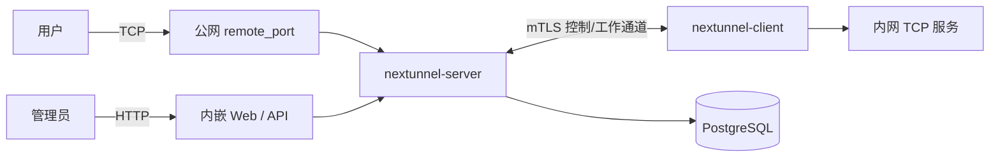

<div align="center">

<h1 style="border-bottom: none"><b>Nextunnel</b></h1>

**面向内网服务的安全反向 TCP 隧道**

出站即连 · 默认 mTLS · PostgreSQL 控制面 · 内嵌 Web 控制台 · Go 单体二进制

[](https://go.dev/)
[](./LICENSE)

<a href="./README.md"></a>
<a href="./README_zh.md"></a>

</div>

## 什么是 Nextunnel

Nextunnel 是一套用于把内网 TCP 服务暴露到公网服务端的反向隧道组件。`nextunnel-client` 运行在内网侧并主动连接 `nextunnel-server`；服务端监听公网代理端口，并把被允许的连接通过 mTLS 控制/工作通道转发回客户端。

与只依赖共享 token 的穿透方案不同，Nextunnel 把客户端证书作为主要接入边界。服务端持有 CA，通过 `RequireAndVerifyClientCert` 校验客户端证书，并将登录身份与该客户端 ID 对应的证书指纹绑定，同时把运行状态存储在 PostgreSQL 中。同一服务端二进制还内嵌 Web 控制台与 HTTP 管理 API。



## 功能特性

- **TCP 反向代理**：通过服务端端口暴露 SSH、数据库、开发服务等内网 TCP 服务。
- **mTLS 优先的接入控制**：服务端可初始化 CA/服务端证书，校验每个客户端证书，并拒绝证书不属于所声明客户端 ID 的登录。
- **客户端接入管理**：注册客户端、分配可选远程端口范围、创建/查看/下载/删除客户端证书。
- **访问控制**：按 IP、国家、省/区域、城市、本地流量、远程流量或全部流量放行/阻断。
- **连接记录**：代理状态和访问日志写入 PostgreSQL。
- **客户端自恢复**：断线后按 2s 到 30s 指数退避自动重连，并通过心跳维护控制通道。
- **内嵌 Web 控制台**：通过 `[server_web]` 提供内置 UI 与 HTTP API，管理客户端、证书和 IP 过滤规则。

## 快速开始

编译服务端需要 Go 1.26+ 与 Node.js/npm（用于内嵌 Web UI）；客户端仅需 Go。

```bash
# 构建服务端和客户端（服务端会先通过 npm 构建 Web UI）。
make build

# 产物位于 bin/，文件名带 VERSION 后缀，例如：
#   bin/nextunnel-server-v1.0.0-alpha
#   bin/nextunnel-client-v1.0.0-alpha
```

1. 启动 PostgreSQL 和 `nextunnel-server`。
2. 打开 Web 控制台（默认 `http://127.0.0.1:25001`）或使用 CLI。
3. 创建客户端与客户端证书，并下载 `ca.crt`、`client.crt`、`client.key`。
4. 将证书文件复制到客户端主机。
5. 配置 `nextunnel-client.toml` 并启动 `nextunnel-client`。

完整命令与配置见组件文档：

- [服务端指南](./docs/zh/server.md)
- [客户端指南](./docs/zh/client.md)
- [文档索引](./docs/README.md)

## 仓库结构

```text
cmd/server/       nextunnel-server CLI 入口
cmd/client/       nextunnel-client CLI 入口
internal/server/  服务端应用、服务、控制器、内嵌 Web 资源与持久化逻辑
internal/client/  客户端应用和转发逻辑
internal/shared/  共享协议、证书、日志和配置工具
web/server/       React 管理台源码（构建后嵌入服务端二进制）
docker/server/    服务端与 PostgreSQL Compose 文件
docker/client/    客户端 Compose 文件
docs/             中英文详细文档
```

## 配置示例

- [`nextunnel-server.example.toml`](./nextunnel-server.example.toml)
- [`nextunnel-client.example.toml`](./nextunnel-client.example.toml)

## 未来规划

- 更多代理类型，包括 UDP 与 HTTP/HTTPS 路由。
- 更完整的证书策略与吊销工作流。
- 面向用户和租户的管理能力。
- 管理 Web/API 的认证能力。

## 许可证

Nextunnel 采用 [Apache License 2.0](./LICENSE)。
