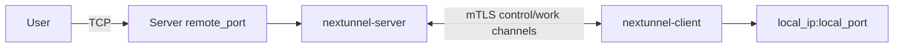

# nextunnel-client

`nextunnel-client` runs inside the private network. It dials `nextunnel-server` over mTLS, logs in with a registered client ID and a matching client certificate, submits local proxy definitions, and bridges server-side inbound traffic to local services.

## Responsibilities

- Connect to the server with TLS 1.2+ and a client certificate.
- Log in with `[client].id`; the certificate fingerprint must belong to that client.
- Register TCP proxies from `[[proxies]]`.
- Open work connections when the server receives traffic on a remote proxy port.
- Forward each work connection to `local_ip:local_port`.
- Reconnect automatically with exponential backoff from 2 seconds up to 30 seconds; the delay resets to 2 seconds after a successful session setup.
- Send heartbeats every 30 seconds on the control channel; control-channel read idle timeout is 90 seconds.



## Requirements

| Dependency | Notes |
| --- | --- |
| Go 1.26+ | Required only when building locally. |
| Client ID | Create it on the server with the web console or `nextunnel-server client create`. The config value may be the client **name or UUID**. |
| mTLS files | `ca.crt`, `client.crt`, and `client.key` generated or downloaded from the server. |

## Quick Start

```bash
# 1. Prepare certificates from the server.
mkdir -p certs
cp /path/to/client-certs/{ca.crt,client.crt,client.key} certs/

# 2. Copy and edit the client config.
cp nextunnel-client.example.toml nextunnel-client.toml

# 3. Build and start the client.
make build-client
./bin/nextunnel-client-$(cat VERSION) --config nextunnel-client.toml
```

On startup, the client loads configuration, initializes mTLS, dials `[server].host:[server].port`, logs in with `[client].id`, submits `[[proxies]]`, and enters the control loop.

## Configuration

See [`../../nextunnel-client.example.toml`](../../nextunnel-client.example.toml) for a complete example.

```toml
[server]
host = "your-server.example.com"
port = 25930

[client]
id = "macbook"

[cert]
ca_file = "certs/ca.crt"
cert_file = "certs/client.crt"
key_file = "certs/client.key"

[[proxies]]
name = "ssh"
type = "tcp"
local_ip = "127.0.0.1"
local_port = 22
remote_port = 5000
```

| Section | Field | Description |
| --- | --- | --- |
| `[server]` | `host` / `port` | Server control endpoint. |
| `[client]` | `id` | Registered client name or UUID. Must not be empty, and must match the client certificate. |
| `[cert]` | `ca_file` / `cert_file` / `key_file` | CA and client certificate files for mTLS; both `cert_file` and `key_file` are required. |
| `[logs]` | `file` / `level` / `maxSize` / `maxBackups` / `maxAge` | Log output and retention. `level` must be `info`, `warn`, or `error`; empty `maxSize` defaults to `100MB`; `0` for `maxBackups` / `maxAge` disables cleanup on that dimension. |
| `[[proxies]]` | `name` | Proxy name, referenced by the server when opening work connections. |
| `[[proxies]]` | `type` | Proxy type. The server currently accepts only `tcp`. |
| `[[proxies]]` | `local_ip` / `local_port` | Local service address reached from the client host/container. |
| `[[proxies]]` | `remote_port` | Public server-side port for this proxy. |

The server also enforces non-empty `name` / `local_ip`, ports in `1–65535`, unique `name` and `remote_port` per client, and that `remote_port` falls inside any assigned port range.

## Proxy Example: SSH

```toml
[[proxies]]
name = "ssh"
type = "tcp"
local_ip = "127.0.0.1"
local_port = 22
remote_port = 5000
```

After the client connects, users can access the local SSH service through `<server-host>:5000`.

If the server assigned a port range to this client, `remote_port` must be inside that range.

## CLI Reference

```bash
nextunnel-client [--config <path>]
```

| Flag | Default | Description |
| --- | --- | --- |
| `--config`, `-c` | `nextunnel-client.toml` | Configuration file path. An explicit flag wins; otherwise `$NEXTUNNEL_CLIENT_CONFIG`, then the default path. |
| `-h`, `--help` | - | Show help. |
| `-v`, `--version` | - | Show version. |

The client runs in the foreground. Press `Ctrl+C` or send `SIGTERM` for graceful shutdown (about 5 seconds to close connections).

## Docker

The client Compose file lives under `docker/client` and uses host networking so `local_ip` can reach services on the host. The image includes `tzdata`; set container `TZ` if you need a specific log timezone.

```bash
cd docker/client

# Prepare these files first:
# volumes/nextunnel/config/nextunnel-client.toml
# volumes/nextunnel/certs/ca.crt
# volumes/nextunnel/certs/client.crt
# volumes/nextunnel/certs/client.key
#
# For Docker, set certificate paths under /etc/nextunnel/certs
# and [logs].file to /var/log/nextunnel/nextunnel-client.log.

docker compose up -d
```

Mounted paths used by the client container:

| Host path | Container path |
| --- | --- |
| `docker/client/volumes/nextunnel/config/nextunnel-client.toml` | `/etc/nextunnel/nextunnel-client.toml` |
| `docker/client/volumes/nextunnel/certs/` | `/etc/nextunnel/certs/` |
| `docker/client/volumes/nextunnel/logs/` | `/var/log/nextunnel/` |

Container default command:

```bash
nextunnel-client --config /etc/nextunnel/nextunnel-client.toml
```
