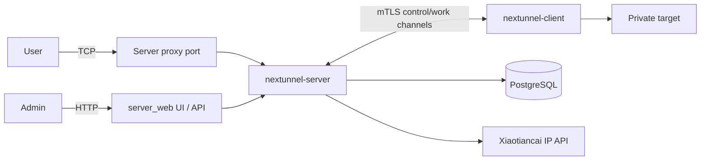

# nextunnel-server

`nextunnel-server` is the public-side component of Nextunnel. It accepts mTLS client connections, listens on remote TCP proxy ports, applies access rules, and forwards accepted traffic to the matching client-side service. The same binary also serves an embedded web console and HTTP management API.

## Responsibilities

- Terminate TLS 1.2+ with `RequireAndVerifyClientCert`.
- Bind each client login to the certificate fingerprint registered for that client ID.
- Create and store client identities, port ranges, certificates, proxies, access rules, and access logs in PostgreSQL (timestamps stored in UTC).
- Listen on remote proxy ports submitted by connected clients.
- Query IP location through the Xiaotiancai Tech API for country, region, and city rules.
- Serve the embedded management UI and `/api` endpoints on `[server_web]`.



## Requirements

| Dependency | Notes |
| --- | --- |
| Go 1.26+ | Required when building locally. |
| Node.js / npm | Required to build the embedded web UI (`web/server`). |
| PostgreSQL | Stores clients, certificates, proxies, access rules, and access logs. |
| IP location API key | **Required.** Set `[ip_location].api_key` (Xiaotiancai Tech SDK). An empty value prevents startup. |

## Quick Start

```bash
# 1. Prepare PostgreSQL, or start only PostgreSQL with Docker Compose.
cd docker/server
cp example.env .env
docker compose -f docker-compose.middleware.yaml up -d
cd ../..

# 2. Copy and edit the server config (fill in [ip_location].api_key).
cp nextunnel-server.example.toml nextunnel-server.toml

# 3. Build and start the server (npm build runs automatically).
make build-server
./bin/nextunnel-server-$(cat VERSION) --config nextunnel-server.toml
```

On startup, the server loads and validates configuration, connects to PostgreSQL (DSN uses `timezone=UTC`), runs migrations, initializes the IP location client, listens on `0.0.0.0:<server.port>`, starts the web listener on `[server_web].host:<port>`, and ensures `ca.crt`, `ca.key`, `server.crt`, and `server.key` exist under `[cert].dir` (auto-generated when missing).

Open the console at `http://127.0.0.1:25001` when using the example defaults.

Logs are written to both the configured file and stdout. Log timestamps and daily rotation use the **system local timezone** (there is no `[timezone]` config). Database and API/CLI display times use UTC.

## Client Onboarding

The usual flow is: create a client record, create a certificate, download the certificate pair, copy `ca.crt`, and configure `nextunnel-client`. You can do this from the web console or the CLI.

```bash
# Create a client. Omit the port range to allow any remote port.
nextunnel-server --config nextunnel-server.toml client create --port-start 5000 --port-end 5005 macbook

# Create a client certificate. Without --expires-at, it is treated as non-expiring by the app.
nextunnel-server --config nextunnel-server.toml client cert create macbook
nextunnel-server --config nextunnel-server.toml client cert list macbook

# Download the certificate pair by certificate ID.
nextunnel-server --config nextunnel-server.toml client cert download --dir ./client-certs macbook <cert-id>

# Copy the CA certificate from the server certificate directory too.
cp certs/ca.crt ./client-certs/
```

Then set the client config:

```toml
[server]
host = "your-server.example.com"
port = 25930

[client]
id = "macbook"

[cert]
ca_file = "certs/ca.crt"
cert_file = "certs/client.crt"
key_file = "certs/client.key"

[[proxies]]
name = "ssh"
type = "tcp"
local_ip = "127.0.0.1"
local_port = 22
remote_port = 5000
```

When the client connects, the server syncs its `[[proxies]]` into PostgreSQL. A proxy is marked online while the client is connected and offline after disconnect. If the client has a port range, every `remote_port` must fall inside that range.

Login also requires that the presented client certificate fingerprint belongs to the claimed `[client].id`. The ID may be the client **name or UUID**. A CA-trusted certificate issued for another client cannot impersonate this ID.

## CLI Reference

```bash
nextunnel-server [--config <path>]
nextunnel-server client create [--port-start <n>] [--port-end <n>] <name>
nextunnel-server client cert create [--expires-at <RFC3339>] <name>
nextunnel-server client cert list <name>
nextunnel-server client cert download [--dir <output-dir>] <name> <cert-id>
nextunnel-server client cert delete <name> <cert-id>
nextunnel-server ip-filter list
nextunnel-server ip-filter add [--allow | --block] [--ip | --country | --region | --city | --all | --local | --remote] [value]
nextunnel-server ip-filter delete [--allow | --block] [--ip | --country | --region | --city | --all | --local | --remote] [value]
```

Global flags:

| Flag | Default | Description |
| --- | --- | --- |
| `--config` | `nextunnel-server.toml` | Configuration file path. An explicit flag wins; otherwise `$NEXTUNNEL_SERVER_CONFIG`, then the default path. |
| `-h`, `--help` | - | Show help. |
| `-v`, `--version` | - | Show version. |

Notes:

- `--port-start` / `--port-end` must be set together and stay in `1–65535`. Omitting both means no port restriction.
- Empty `--expires-at` means non-expiring; otherwise values are parsed as RFC3339 and stored in UTC.
- `ip-filter add|delete` requires exactly one of `--allow`/`--block` and exactly one match type. `--all` / `--local` / `--remote` must not take a value.
- Client deletion is available only via HTTP API (`DELETE /api/clients/{name}`); there is no CLI subcommand for it.

## Access Rules

Rules are stored in PostgreSQL. The server caches them in memory for about **10 seconds**, so new rules usually take effect within a few seconds without restarting the process.

```bash
nextunnel-server ip-filter add --allow --ip 203.0.113.10
nextunnel-server ip-filter add --block --city Shenzhen
nextunnel-server ip-filter add --allow --region Guangdong
nextunnel-server ip-filter add --block --country China
nextunnel-server ip-filter add --block --all
nextunnel-server ip-filter add --allow --local
nextunnel-server ip-filter add --block --remote
```

| Topic | Details |
| --- | --- |
| Match fields | IP, country, region, city, all traffic, local traffic, or remote traffic. |
| Default | Connections are allowed when no rule matches. |
| Tie-breaker | At equal specificity, allow beats block. |
| Priority | IP > city > region > country > local/remote > all. |
| Geo names | Country, region, and city values must match the IP API response (`region` maps to the API Province field). |
| Local traffic | `IsPrivate` / `IsLoopback` / `IsLinkLocalUnicast` are treated as local and skip geo lookup. |
| API key | `[ip_location].api_key` is required at startup. Failed lookups leave location empty for that request, so geo rules will not match. |

## Configuration

See [`../../nextunnel-server.example.toml`](../../nextunnel-server.example.toml) for a complete example.

| Section | Field | Description |
| --- | --- | --- |
| `[server]` | `port` | Public control/listen port. The tunnel listener binds to all interfaces. Defaults to `25930` when unset or ≤0. |
| `[server_web]` | `host` / `port` | Management UI and HTTP API listen address. Defaults to `127.0.0.1:25001`. |
| `[cert]` | `host` | **Required.** Hostname or IP used in generated certificate SANs (plus `localhost`, `127.0.0.1`, `::1`). |
| `[cert]` | `dir` | **Required.** Certificate directory for CA, server certs, and generated client certs. |
| `[database]` | `host` / `port` / `username` / `password` / `db` / `sslmode` | **All required.** PostgreSQL connection settings; `sslmode` has no default. |
| `[ip_location]` | `api_key` | **Required.** Xiaotiancai Tech IP location API key. |
| `[logs]` | `file` / `level` / `maxSize` / `maxBackups` / `maxAge` | Log output and retention. Default file path is `logs/nextunnel.log`; `level` must be `info`, `warn`, or `error`; defaults are `100MB` / `30` / `7` for size, backups, and age. |

There is no configurable timezone. Database and API times are UTC; log display and daily rotation follow the system local timezone.

## Docker

The server Compose files live under `docker/server`. The server container uses host networking so control, web, and proxy ports come from the TOML config. The image includes `tzdata`; set container `TZ` if you need a specific log timezone.

```bash
cd docker/server
cp example.env .env

# Edit volumes/nextunnel/config/nextunnel-server.toml first.
# For Docker, set [cert].dir = "/etc/nextunnel/certs",
# [logs].file = "/var/log/nextunnel/nextunnel-server.log",
# and fill in [ip_location].api_key.
docker compose up -d

# Or start PostgreSQL only.
docker compose -f docker-compose.middleware.yaml up -d
```

Mounted paths used by the server container:

| Host path | Container path |
| --- | --- |
| `docker/server/volumes/nextunnel/config/nextunnel-server.toml` | `/etc/nextunnel/nextunnel-server.toml` |
| `docker/server/volumes/nextunnel/certs/` | `/etc/nextunnel/certs/` |
| `docker/server/volumes/nextunnel/logs/` | `/var/log/nextunnel/` |

## Web Console and HTTP API

The management surface always starts with the server. It serves:

- the embedded React console (SPA fallback to `index.html`)
- the `/api` management endpoints

There is no built-in HTTP authentication. Keep `[server_web].host` on a loopback or private address, or put the listener behind a firewall / authenticated reverse proxy. The example config binds `127.0.0.1:25001`.

API timestamps use UTC in the form `2006-01-02T15:04:05Z`.

| Endpoint | Purpose |
| --- | --- |
| `GET /api/clients` / `POST /api/clients` / `DELETE /api/clients/{name}` | Manage client records. |
| `GET /api/clients/{name}/sharedcerts` / `POST /api/clients/{name}/sharedcerts` | List and create client certificates. |
| `GET /api/clients/{name}/sharedcerts/{id}/download` | Download a client certificate zip. |
| `DELETE /api/clients/{name}/sharedcerts/{id}` | Delete a client certificate. |
| `GET /api/ca` | Download `ca.crt`. |
| `GET /api/ip-filters` / `POST /api/ip-filters` / `DELETE /api/ip-filters` | Manage access rules. |
