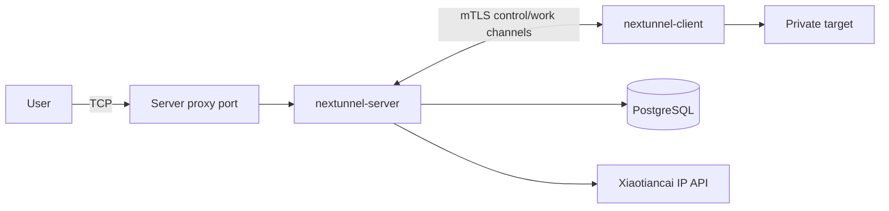

# nextunnel-server

`nextunnel-server` is the public-side component of Nextunnel. It accepts mTLS client connections, listens on remote TCP proxy ports, applies access rules, and forwards accepted traffic to the matching client-side service.

## Responsibilities

- Terminate TLS 1.2+ with `RequireAndVerifyClientCert`.
- Create and store client identities, port ranges, certificates, proxies, access rules, and access logs in PostgreSQL.
- Listen on remote proxy ports submitted by connected clients.
- Query IP location through the Xiaotiancai API and use the result for country, region, and city rules.
- Expose an optional HTTP management API when `[web].enabled = true`.



## Requirements

| Dependency | Notes |
| --- | --- |
| Go 1.26+ | Required only when building locally. |
| PostgreSQL | Stores clients, certificates, proxies, access rules, and access logs. |
| IP location API key | Configure `[ip_location].api_key`; the server requires it at startup. |

## Quick Start

```bash
# 1. Prepare PostgreSQL, or start only PostgreSQL with Docker Compose.
cd docker/server
cp example.env .env
docker compose -f docker-compose.middleware.yaml up -d
cd ../..

# 2. Copy and edit the server config.
cp nextunnel-server.example.toml nextunnel-server.toml

# 3. Build and start the server.
mkdir -p bin
go build -o bin/nextunnel-server ./cmd/server
./bin/nextunnel-server --config nextunnel-server.toml
```

On startup, the server loads configuration, connects to PostgreSQL, runs migrations, initializes the IP location client, listens on `0.0.0.0:<server.port>`, and ensures `ca.crt`, `ca.key`, `server.crt`, and `server.key` exist under `[cert].dir`.

## Client Onboarding

The usual flow is: create a client record, create a certificate, download the certificate pair, copy `ca.crt`, and configure `nextunnel-client`.

```bash
# Create a client. Omit the port range to allow any remote port.
nextunnel-server --config nextunnel-server.toml client create --port-start 5000 --port-end 5005 macbook

# Create a client certificate. Without --expires-at, it is treated as non-expiring by the app.
nextunnel-server --config nextunnel-server.toml client cert create macbook
nextunnel-server --config nextunnel-server.toml client cert list macbook

# Download the certificate pair by certificate ID.
nextunnel-server --config nextunnel-server.toml client cert download --dir ./client-certs macbook <cert-id>

# Copy the CA certificate from the server certificate directory too.
cp certs/ca.crt ./client-certs/
```

Then set the client config:

```toml
[server]
host = "your-server.example.com"
port = 25930

[client]
id = "macbook"

[cert]
ca_file = "certs/ca.crt"
cert_file = "certs/client.crt"
key_file = "certs/client.key"

[[proxies]]
name = "ssh"
type = "tcp"
local_ip = "127.0.0.1"
local_port = 22
remote_port = 5000
```

When the client connects, the server syncs its `[[proxies]]` into PostgreSQL. A proxy is marked online while the client is connected and offline after disconnect. If the client has a port range, every `remote_port` must fall inside that range.

## CLI Reference

```bash
nextunnel-server [--config <path>]
nextunnel-server client create [--port-start <n>] [--port-end <n>] <name>
nextunnel-server client cert create [--expires-at <RFC3339>] <name>
nextunnel-server client cert list <name>
nextunnel-server client cert download [--dir <output-dir>] <name> <cert-id>
nextunnel-server client cert delete <name> <cert-id>
nextunnel-server ip-filter list
nextunnel-server ip-filter add [--allow | --block] [--ip | --country | --region | --city | --all | --local | --remote] [value]
nextunnel-server ip-filter delete [--allow | --block] [--ip | --country | --region | --city | --all | --local | --remote] [value]
```

Global flags:

| Flag | Default | Description |
| --- | --- | --- |
| `--config` | `nextunnel-server.toml` | Configuration file path. If not set, the loader can fall back to `NEXTUNNEL_SERVER_CONFIG`. |
| `-h`, `--help` | - | Show help. |
| `-v`, `--version` | - | Show version. |

## Access Rules

Rules are stored in PostgreSQL and take effect without restarting the server.

```bash
nextunnel-server ip-filter add --allow --ip 203.0.113.10
nextunnel-server ip-filter add --block --city Shenzhen
nextunnel-server ip-filter add --allow --region Guangdong
nextunnel-server ip-filter add --block --country China
nextunnel-server ip-filter add --block --all
nextunnel-server ip-filter add --allow --local
nextunnel-server ip-filter add --block --remote
```

| Topic | Details |
| --- | --- |
| Match fields | IP, country, region, city, all traffic, local traffic, or remote traffic. |
| Default | Connections are allowed when no rule matches. |
| Tie-breaker | At equal specificity, allow beats block. |
| Priority | IP > city > region > country > local/remote > all. |
| Geo names | Country, region, and city values must match the active IP API response. |

## Configuration

See [`../../nextunnel-server.example.toml`](../../nextunnel-server.example.toml) for a complete example.

| Section | Field | Description |
| --- | --- | --- |
| `[server]` | `port` | Public control/listen port. The server binds to all interfaces. |
| `[cert]` | `host` | Hostname or IP used in generated certificate SANs. |
| `[cert]` | `dir` | Certificate directory for CA, server certs, and generated client certs. |
| `[database]` | `host` / `port` / `username` / `password` / `db` / `sslmode` | PostgreSQL connection. |
| `[ip_location]` | `api_key` | Required API key for IP location lookup. |
| `[logs]` | `file` / `level` / `maxSize` / `maxBackups` / `maxAge` | Log output and retention settings. |
| `[timezone]` | `location` | IANA timezone, defaulting to `Asia/Shanghai` when unset. |
| `[web]` | `enabled` / `port` | Enables the HTTP management API, default port `25001` when enabled and unset. |

## Docker

The server Compose files live under `docker/server`.

```bash
cd docker/server
cp example.env .env

# Edit volumes/nextunnel/config/nextunnel-server.toml first.
docker compose up -d

# Or start PostgreSQL only.
docker compose -f docker-compose.middleware.yaml up -d
```

Mounted paths used by the server container:

| Host path | Container path |
| --- | --- |
| `docker/server/volumes/nextunnel/config/nextunnel-server.toml` | `/etc/nextunnel/nextunnel-server.toml` |
| `docker/server/volumes/nextunnel/certs/` | `/etc/nextunnel/certs/` |
| `docker/server/volumes/nextunnel/logs/` | `/var/log/nextunnel/` |

## HTTP Management API

When `[web].enabled = true`, the server starts an HTTP API on `[web].port`.

The API currently binds to `0.0.0.0` and does not add an authentication layer by itself. Expose it only behind a firewall, private network, or authenticated reverse proxy.

| Endpoint | Purpose |
| --- | --- |
| `GET /api/version` | Return server version. |
| `GET /api/clients` / `POST /api/clients` / `DELETE /api/clients/{name}` | Manage client records. |
| `GET /api/clients/{name}/sharedcerts` / `POST /api/clients/{name}/sharedcerts` | List and create client certificates. |
| `GET /api/clients/{name}/sharedcerts/{id}/download` | Download a client certificate zip. |
| `DELETE /api/clients/{name}/sharedcerts/{id}` | Delete a client certificate. |
| `GET /api/ca` | Download `ca.crt`. |
| `GET /api/ip-filters` / `POST /api/ip-filters` / `DELETE /api/ip-filters` | Manage access rules. |
