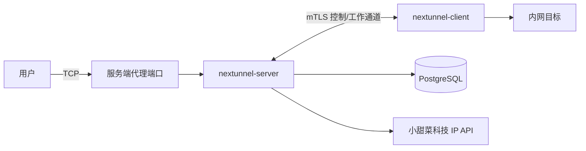

# nextunnel-server

`nextunnel-server` 是 Nextunnel 的公网侧组件。它接收客户端的 mTLS 连接，监听公网 TCP 代理端口，执行访问规则，并把被允许的流量转发到对应客户端后的内网服务。

## 职责

- 使用 TLS 1.2+，并通过 `RequireAndVerifyClientCert` 校验客户端证书。
- 在 PostgreSQL 中保存客户端、证书、代理、访问规则和访问日志。
- 根据客户端提交的代理配置监听远程端口。
- 通过小甜菜科技 IP API 查询归属地，并用于国家、省/区域、城市规则。
- 当 `[web].enabled = true` 时暴露可选 HTTP 管理 API。



## 环境要求

| 依赖 | 说明 |
| --- | --- |
| Go 1.26+ | 仅本地编译时需要。 |
| PostgreSQL | 保存客户端、证书、代理、访问规则和访问日志。 |
| IP 归属地 API Key | 配置 `[ip_location].api_key`；服务端启动时必需。 |

## 快速开始

```bash
# 1. 准备 PostgreSQL，或用 Docker Compose 只启动 PostgreSQL。
cd docker/server
cp example.env .env
docker compose -f docker-compose.middleware.yaml up -d
cd ../..

# 2. 复制并编辑服务端配置。
cp nextunnel-server.example.toml nextunnel-server.toml

# 3. 编译并启动服务端。
mkdir -p bin
go build -o bin/nextunnel-server ./cmd/server
./bin/nextunnel-server --config nextunnel-server.toml
```

启动后，服务端会加载配置、连接 PostgreSQL、执行迁移、初始化 IP 归属地客户端、监听 `0.0.0.0:<server.port>`，并确保 `[cert].dir` 下存在 `ca.crt`、`ca.key`、`server.crt`、`server.key`。

## 接入客户端

常见流程是：创建客户端记录、创建证书、下载证书对、复制 `ca.crt`，然后配置 `nextunnel-client`。

```bash
# 创建客户端。省略端口范围表示允许使用任意 remote_port。
nextunnel-server --config nextunnel-server.toml client create --port-start 5000 --port-end 5005 macbook

# 创建客户端证书。未指定 --expires-at 时，应用会将其视为长期有效证书。
nextunnel-server --config nextunnel-server.toml client cert create macbook
nextunnel-server --config nextunnel-server.toml client cert list macbook

# 用证书 ID 下载 client.crt/client.key。
nextunnel-server --config nextunnel-server.toml client cert download --dir ./client-certs macbook <cert-id>

# 同时从服务端证书目录复制 CA 证书。
cp certs/ca.crt ./client-certs/
```

然后配置客户端：

```toml
[server]
host = "your-server.example.com"
port = 25930

[client]
id = "macbook"

[cert]
ca_file = "certs/ca.crt"
cert_file = "certs/client.crt"
key_file = "certs/client.key"

[[proxies]]
name = "ssh"
type = "tcp"
local_ip = "127.0.0.1"
local_port = 22
remote_port = 5000
```

客户端连接后，服务端会把它的 `[[proxies]]` 同步到 PostgreSQL。客户端在线时代理标记为在线，断开后标记为离线。如果客户端配置了端口范围，每个 `remote_port` 都必须在该范围内。

## CLI 参考

```bash
nextunnel-server [--config <path>]
nextunnel-server client create [--port-start <n>] [--port-end <n>] <name>
nextunnel-server client cert create [--expires-at <RFC3339>] <name>
nextunnel-server client cert list <name>
nextunnel-server client cert download [--dir <output-dir>] <name> <cert-id>
nextunnel-server client cert delete <name> <cert-id>
nextunnel-server ip-filter list
nextunnel-server ip-filter add [--allow | --block] [--ip | --country | --region | --city | --all | --local | --remote] [value]
nextunnel-server ip-filter delete [--allow | --block] [--ip | --country | --region | --city | --all | --local | --remote] [value]
```

全局参数：

| 参数 | 默认值 | 说明 |
| --- | --- | --- |
| `--config` | `nextunnel-server.toml` | 配置文件路径；未指定时加载器可回退到 `NEXTUNNEL_SERVER_CONFIG`。 |
| `-h`, `--help` | - | 显示帮助。 |
| `-v`, `--version` | - | 显示版本。 |

## 访问规则

规则存储在 PostgreSQL 中，服务端运行时即时生效，无需重启。

```bash
nextunnel-server ip-filter add --allow --ip 203.0.113.10
nextunnel-server ip-filter add --block --city Shenzhen
nextunnel-server ip-filter add --allow --region Guangdong
nextunnel-server ip-filter add --block --country China
nextunnel-server ip-filter add --block --all
nextunnel-server ip-filter add --allow --local
nextunnel-server ip-filter add --block --remote
```

| 项目 | 说明 |
| --- | --- |
| 匹配字段 | IP、国家、省/区域、城市、全部流量、本地流量、远程流量。 |
| 默认策略 | 没有规则匹配时允许连接。 |
| 同级规则 | 精确度相同时，允许规则优先于阻断规则。 |
| 优先级 | IP > 城市 > 省/区域 > 国家 > 本地/远程 > 全部。 |
| 地域名称 | 国家、省/区域和城市值必须与当前 IP API 返回结果一致。 |

## 配置说明

完整示例见 [`../../nextunnel-server.example.toml`](../../nextunnel-server.example.toml)。

| 配置段 | 字段 | 说明 |
| --- | --- | --- |
| `[server]` | `port` | 公网控制/监听端口；服务端绑定所有网卡。 |
| `[cert]` | `host` | 自动生成证书时写入 SAN 的主机名或 IP。 |
| `[cert]` | `dir` | 证书目录，用于 CA、服务端证书和生成的客户端证书。 |
| `[database]` | `host` / `port` / `username` / `password` / `db` / `sslmode` | PostgreSQL 连接配置。 |
| `[ip_location]` | `api_key` | IP 归属地查询所需 API Key。 |
| `[logs]` | `file` / `level` / `maxSize` / `maxBackups` / `maxAge` | 日志输出与保留策略。 |
| `[timezone]` | `location` | IANA 时区；未配置时默认 `Asia/Shanghai`。 |
| `[web]` | `enabled` / `port` | 开启 HTTP 管理 API；启用且未配置端口时默认 `25001`。 |

## Docker

服务端 Compose 文件位于 `docker/server`。

```bash
cd docker/server
cp example.env .env

# 先编辑 volumes/nextunnel/config/nextunnel-server.toml。
docker compose up -d

# 或只启动 PostgreSQL。
docker compose -f docker-compose.middleware.yaml up -d
```

服务端容器挂载路径：

| 宿主机路径 | 容器路径 |
| --- | --- |
| `docker/server/volumes/nextunnel/config/nextunnel-server.toml` | `/etc/nextunnel/nextunnel-server.toml` |
| `docker/server/volumes/nextunnel/certs/` | `/etc/nextunnel/certs/` |
| `docker/server/volumes/nextunnel/logs/` | `/var/log/nextunnel/` |

## HTTP 管理 API

当 `[web].enabled = true` 时，服务端会在 `[web].port` 启动 HTTP API。

该 API 当前绑定 `0.0.0.0`，代码层没有内置认证。建议只在防火墙、私有网络或带认证的反向代理后暴露。

| 接口 | 作用 |
| --- | --- |
| `GET /api/version` | 返回服务端版本。 |
| `GET /api/clients` / `POST /api/clients` / `DELETE /api/clients/{name}` | 管理客户端记录。 |
| `GET /api/clients/{name}/sharedcerts` / `POST /api/clients/{name}/sharedcerts` | 查看和创建客户端证书。 |
| `GET /api/clients/{name}/sharedcerts/{id}/download` | 下载客户端证书 zip。 |
| `DELETE /api/clients/{name}/sharedcerts/{id}` | 删除客户端证书。 |
| `GET /api/ca` | 下载 `ca.crt`。 |
| `GET /api/ip-filters` / `POST /api/ip-filters` / `DELETE /api/ip-filters` | 管理访问规则。 |
